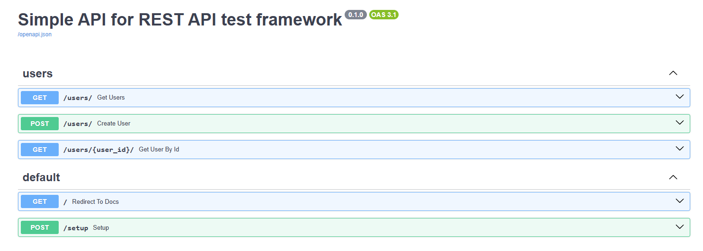
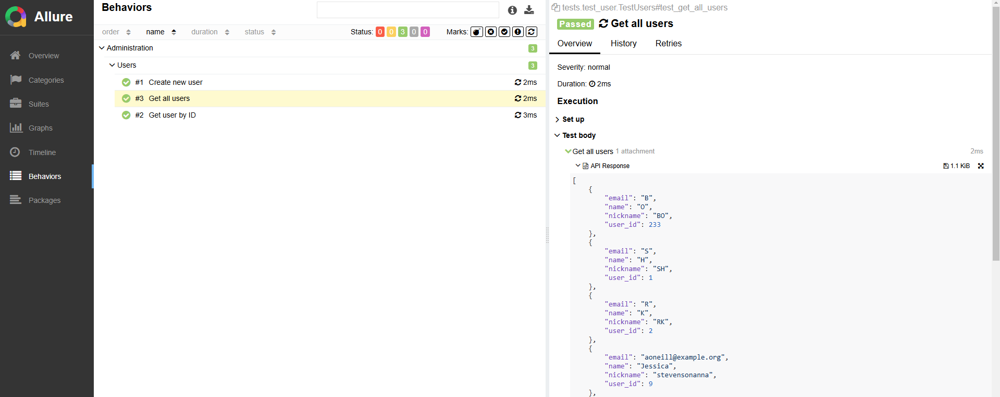

# REST API Tests Framework with FastAPI  

This repository contains a test framework for REST APIs built using Python's `pytest` and `requests` libraries. Additionally, it includes a simple FastAPI application that serves as a mock API for testing purposes.  

## Features  
- **`FastAPI`**: Provides a minimal REST API with `custom authentication` to serve as a target for the tests.  
- **`Test Framework`**: Built with `pytest` and `requests` for end-to-end API testing.
- **`Custom authentication` is implemented for all protected endpoints using a custom ``TOKEN`` header**
- **`Environment Variables Support`**: Uses `python-dotenv` to manage sensitive data like API tokens.  
- **`Session-Level Setup`**: Ensures the test environment is initialized before running tests.  
- **`Allure Reports`**: Provides visually appealing and detailed test reports using Allure.
---

## Authentication
All endpoints that require authentication will check the TOKEN header. 
If the token is missing or incorrect, the request will be rejected with a 401 Unauthorized response.

- **Header**: `TOKEN`
- **Value**: `MY_SUPER_SECRET_API_TOKEN`


## Prerequisites  

Before running the project, make sure you have the following installed:  

- Python 3.10 or higher  
- `pip` (Python package manager)  
- Follow the [Allure installation guide](https://allurereport.org/start/) for your operating system.

---

## Installation  

1. **Clone the repository**  
   ```bash  
   git clone https://github.com/Bohdan-Orlyk/REST_API_test_framework.git 
   cd repo-name
   ```
   
2. **Set up a virtual environment (optional but recommended)**
   ```bash
   python -m venv venv  
   source venv/bin/activate  
   # On Windows: venv\Scripts\activate or venv\Scripts\activate.ps1
   ```
   
3. **Install dependencies**
   ```bash
   pip install -r req.txt
   ```
   
4. **Set up environment variables in test framework directory**
   - Create a `.env` file in the root directory to store environment variables:
     - `API_TOKEN="api_token"`
     - `HOST="api_host"`
     
5. **Start the FastAPI server**
   - In `app.py`
   ```python
    if __name__ == "__main__":
        uvicorn.run(app)
   ```
     
   - Or from `Terminal`:
   ```bash
    uvicorn app:app --reload
   ```

6. **Run tests with Allure support in test framework directory:**
    ```bash
    pytest -sv --alluredir=allure-results
    ```

7. **Generate and serve the report**
    ```bash
    allure serve allure-results  
    ```
## Images

1. **API docs**
   
2. **Allure report**
   